# RCA Chat Agent - Architecture Visual Diagrams

This document contains comprehensive visual diagrams for the RCA Chat Agent system architecture, data flow, and deployment topology.

---

## 1. System Architecture Overview

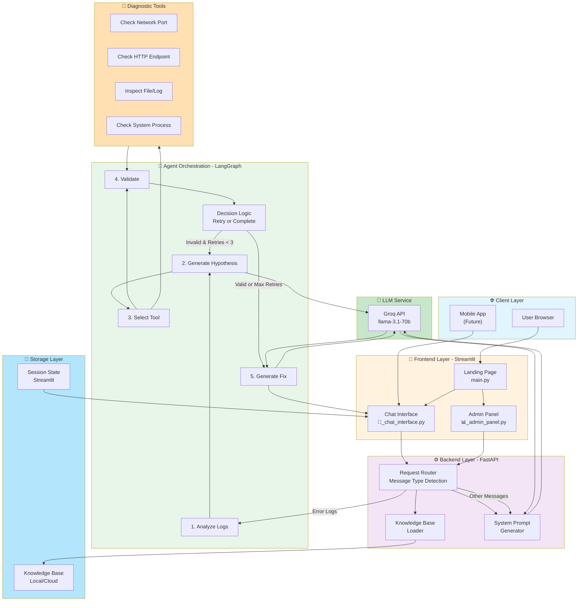

---

## 2. Request Flow Diagram (Error Log Analysis)

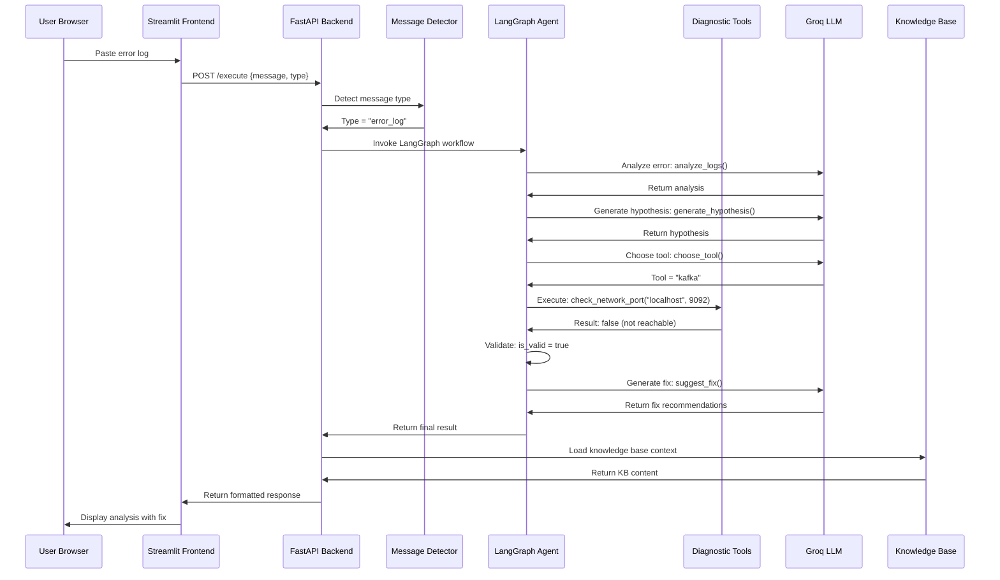

---

## 3. Message Type Routing Flow

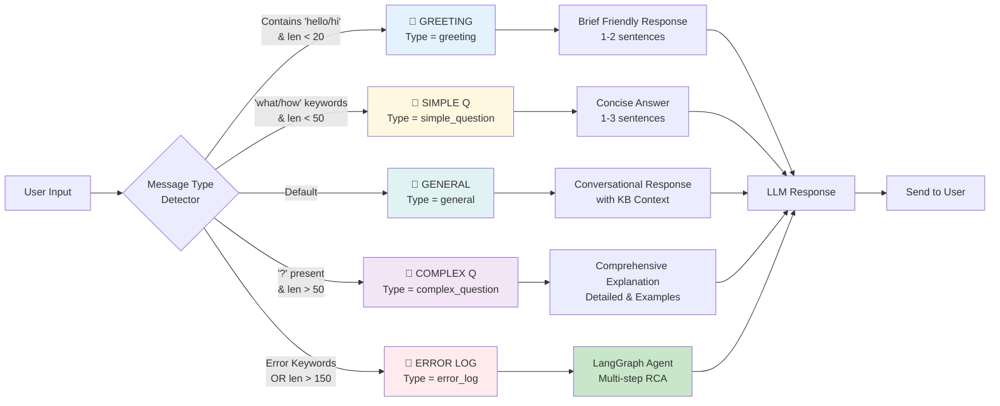

---

## 4. LangGraph Agent Workflow (Error Logs)

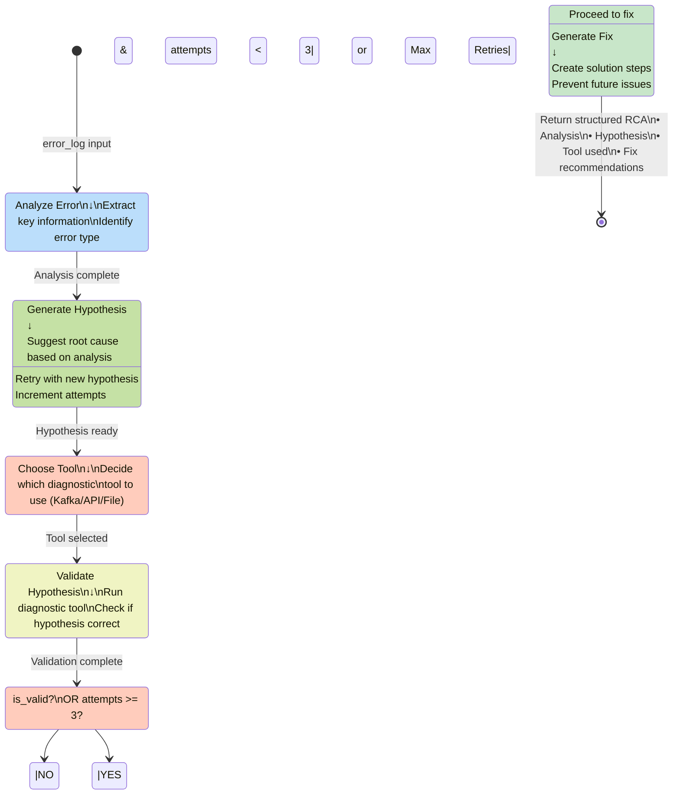

---

## 5. Frontend Architecture (Streamlit)

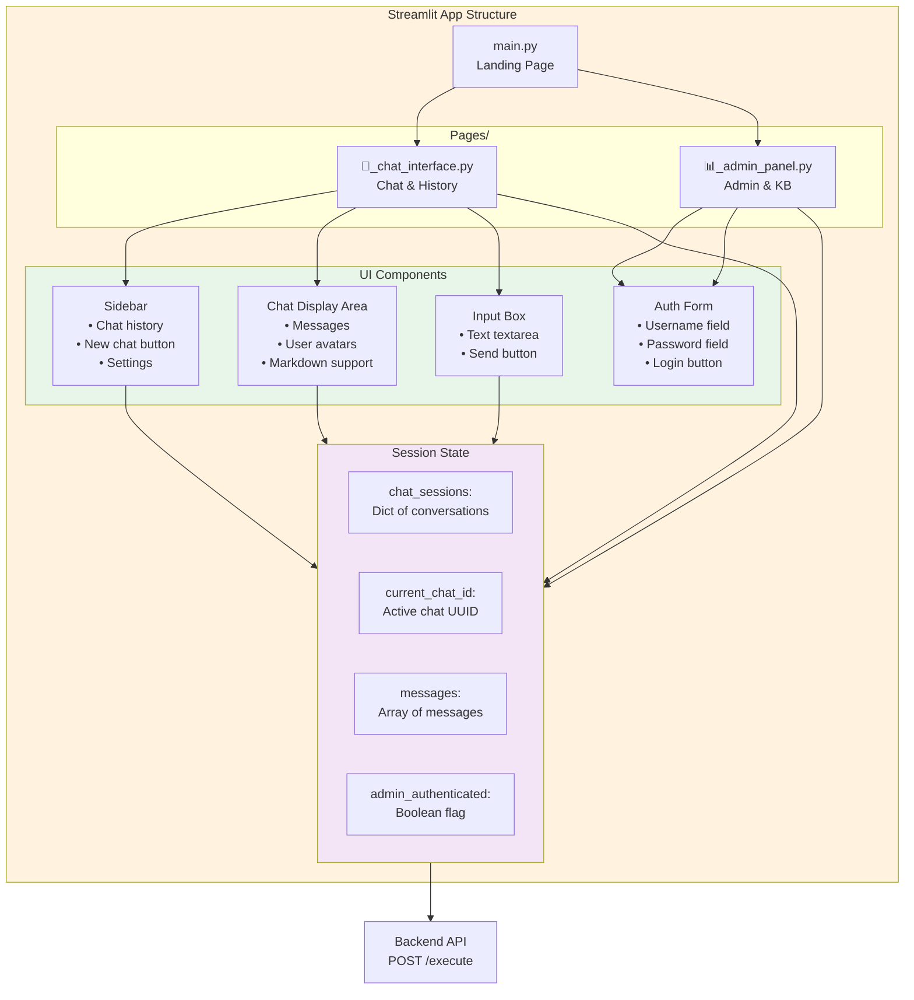

---

## 6. Backend Architecture (FastAPI)

```mermaid
graph TB
    subgraph FastAPI["FastAPI Application"]
        
        subgraph Routes["API Routes"]
            Root["GET /<br/>API Info"]
            Health["GET /health<br/>Status Check"]
            Execute["POST /execute<br/>Chat Endpoint"]
        end
        
        subgraph Logic["Business Logic"]
            TypeDetector["get_message_type()<br/>Classify query"]
            SystemPromptGen["get_system_prompt()<br/>Generate instructions"]
            KBLoader["load_knowledge_base()<br/>Load docs"]
        end
        
        subgraph Integration["Integration Layer"]
            ErrorLogRoute["Error Log Path<br/>→ LangGraph Agent"]
            OtherRoute["Other Query Path<br/>→ Direct LLM"]
        end
        
        subgraph Response["Response Formatting"]
            RCAFormatter["Format RCA Result<br/>• Analysis<br/>• Hypothesis<br/>• Tools used<br/>• Fix steps"]
            LLMFormatter["Format LLM Result<br/>• Response content<br/>• Message type"]
        end
        
        subgraph Middleware["Middleware & Config"]
            CORS["CORS Handler<br/>Allow all origins"]
            ErrorHandler["Error Handler<br/>500 responses"]
        end
    end
    
    Routes --> Logic
    Logic --> Integration
    Integration --> ErrorLogRoute
    Integration --> OtherRoute
    
    ErrorLogRoute --> RCAFormatter
    OtherRoute --> LLMFormatter
    
    RCAFormatter --> Response["ChatResponse<br/>JSON"]
    LLMFormatter --> Response
    
    Middleware --> Routes
    
    style Routes fill:#bbdefb
    style Logic fill:#c5e1a5
    style Integration fill:#ffccbc
    style Response fill:#c8e6c9
```

---

## 7. Deployment Architecture (Render)

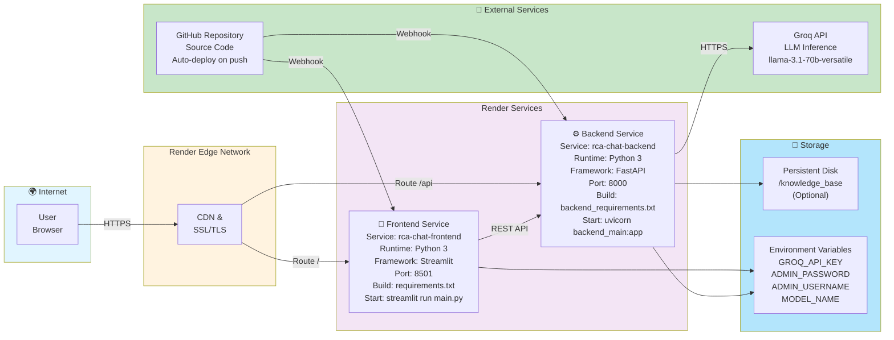

---

## 8. Data Flow Diagram

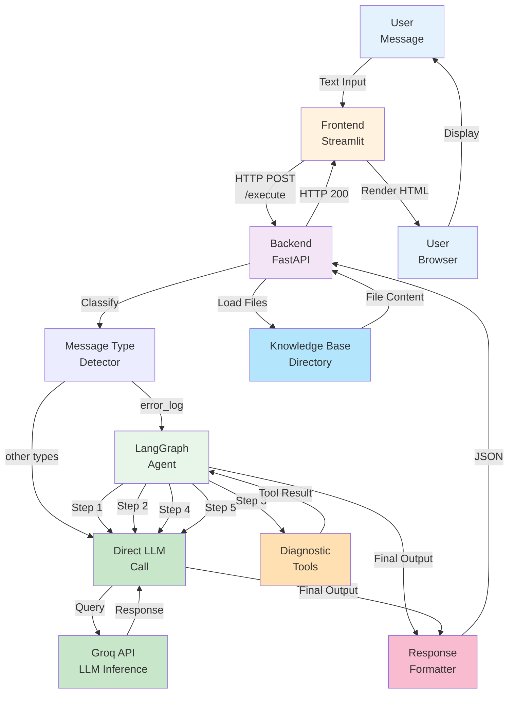

---

## 9. Component Interaction Matrix

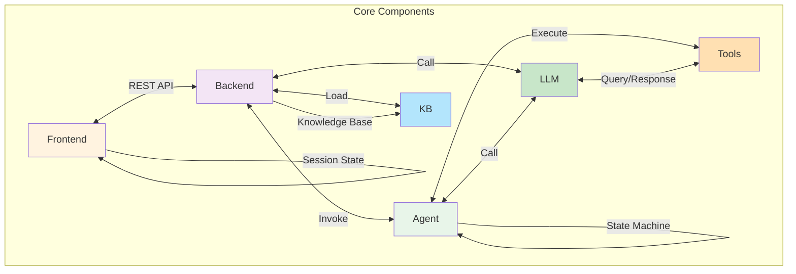

---

## 10. Error Log Analysis Flow (Detailed)

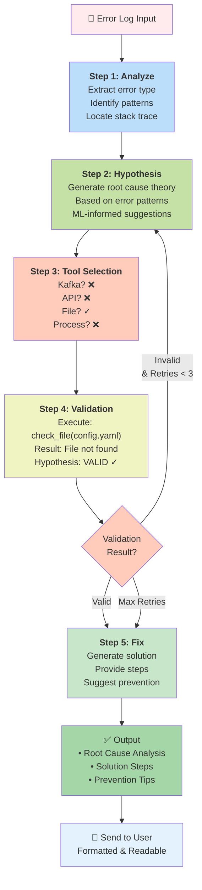

---

## 11. Knowledge Base Integration Flow

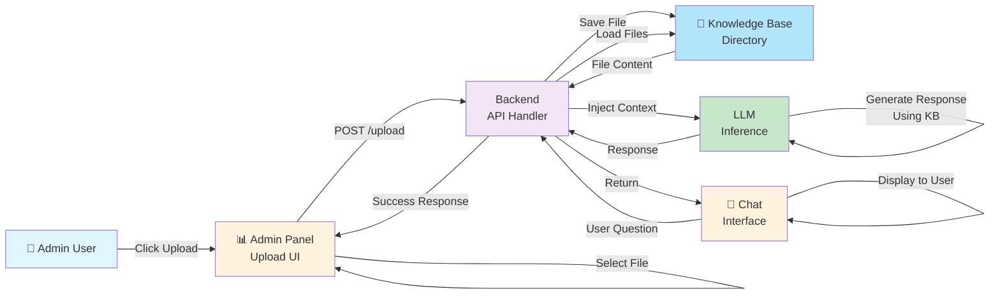

---

## 12. Security Architecture

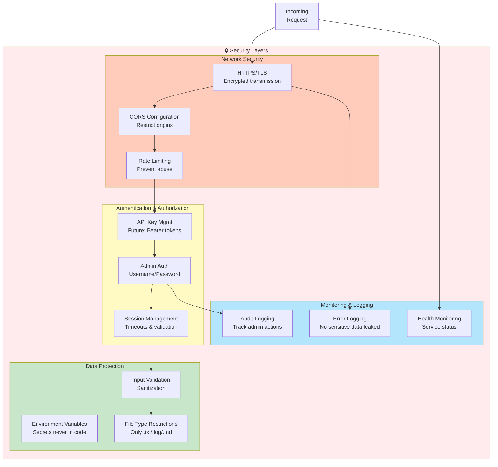

---

## 13. Deployment Stages

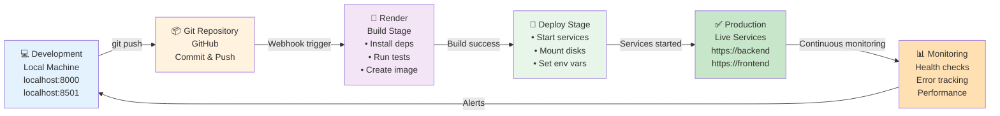

---

## Quick Reference Legend

### Colors Used

| Color | Meaning |
|-------|---------|
| 🔵 Blue | User/Client Layer |
| 🟠 Orange | Frontend/UI |
| 🟣 Purple | Backend/Processing |
| 🟢 Green | AI/LLM & Agents |
| 🟡 Yellow | Logic & Decision |
| 🔴 Red | Error/Security |
| 🔵 Light Blue | Storage/Data |

### Diagram Types

| Type | Use | Files |
|------|-----|-------|
| Graph TB | System components & flow | All diagrams |
| Sequence | Message interactions | Request Flow, Data Flow |
| State | Workflow states | LangGraph Agent |
| LR Flow | Linear processes | Deployment Stages |

---

**Note**: These diagrams can be rendered in:
- GitHub (markdown with mermaid blocks)
- VS Code (mermaid extension)
- Online viewers (mermaid.live)
- Confluence, Notion, Obsidian, etc.

**Last Updated**: June 9, 2026
